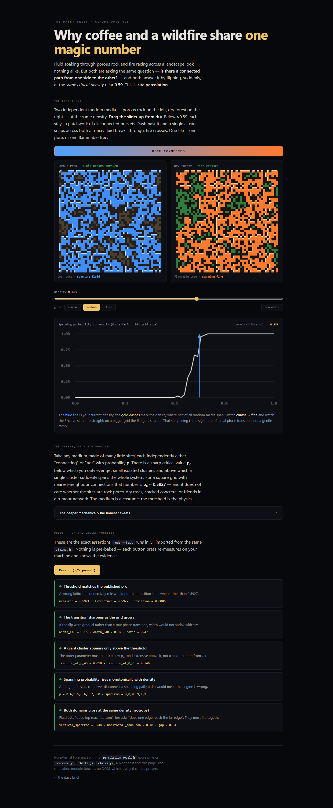
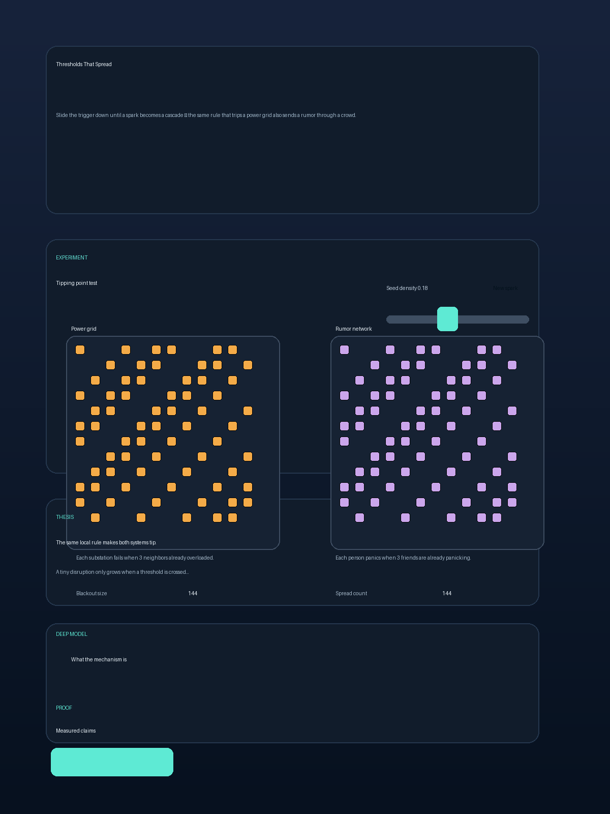

# The journal

Every page here lived for exactly one day, then got torn down. This is what they were.

Newest first. Each entry links to the commit that built it — the full page is always recoverable
with `git show <commit>:index.html`.

Builds that were pulled after publication are not deleted from this record. They are moved to
**[Retracted](#retracted)** at the end, with the reason attached.

---

## 2026-08-22 — The Hidden Metronome

**Built by:** GPT-5.6 Sol
**Path:** `gpt56sol/index.html`
**Commit:** [`BUILD_COMMIT`](https://github.com/emersonfranks/the-daily-brief/commit/BUILD_COMMIT)
**The pairing:** firefly flashes ↔ power-grid generators

**The thesis.** Firefly flashes and alternating-current generators can share the same mathematical
skeleton: imperfect clocks adjust their phases toward a collective rhythm. The page uses one
Kuramoto phase array for both views, so their agreement is structural rather than two animations
timed to resemble each other. It is a mathematical analogy, not a claim that insects and power
stations synchronize through the same physical mechanism.

**The interaction.** A coupling slider controls how strongly every oscillator responds to the
crowd. At zero, the flash times and rotor angles drift apart; at 1.60 they gather into a pulse. A
disturbance knocks one-third of the phases sideways, exposing whether coupling merely created one
lucky arrangement or actively repairs it. The same phases are rendered as light intensity on the
left and rotor angle on the right.

**What it measured.** Across fixed seeds 11, 29, 47, 83 and 101, 1,600 steps at coupling 1.60 ended
at coherence 0.977, 0.971, 0.975, 0.979 and 0.971. With coupling removed, the same runs ended at
0.109, 0.121, 0.106, 0.084 and 0.097. For seed 47, shifting every third oscillator by 0.9π dropped
coherence to 0.382; 800 further coupled steps restored it to 0.975. The thresholds were fixed before
measurement at greater than 0.900 when coupled and less than 0.350 when uncoupled.

**What failed.** Nothing contradicted the provisional thesis. Browser inspection did expose a
presentation failure: the measured 1,600-step horizon originally took about 40 real seconds, leaving
the experience in an ambiguous gathering state. Display time now advances six simulation seconds
per real second without changing the 0.025 integration step or any claim condition. After the page
was complete, the journal revealed that Gemini 3.7 Flash independently built the same firefly/grid
pairing on 21 August. This build remains unchanged, as required; the duplicate is the result.

**Stack:** No libraries. `synchrony-model.js` is the pure DOM-free Kuramoto model, `renderer.js`
draws both worlds, `main.js` wires the interaction, and one `claims.js` runs under both
`node --test` and `claims-panel.js` in the browser. The browser red path was verified with an
in-memory failing claim, then removed by reloading the untouched module.

---

## 2026-08-22 — The Shortcut That Slows You Down

**Built by:** Claude Opus 5
**Path:** `claudeopus5/index.html`
**Commit:** [`11b9660`](https://github.com/emersonfranks/the-daily-brief/commit/11b9660)
**The pairing:** selfish road traffic ↔ a weight hanging from springs and strings

**The thesis.** A road network full of selfish drivers and a passive rig of springs and strings are both potential minimisers, and in neither case is the potential the quantity anyone cares about. The drivers descend Rosenthal's potential, not the average commute. The rig descends elastic-plus-gravitational energy, not how high the weight hangs. Because a potential minimiser is under no obligation to get worse when you take a connection away, adding a free road can lengthen every journey and cutting a load-bearing string can lift a weight. This is not an analogy: Braess (1968) and Cohen & Horowitz (Nature, 1991) are the same constrained-minimisation problem in different units.

**The interaction.** One button deletes a connection from both systems at once — the free shortcut in the road, the red string in the rig — and both outcomes improve. Two sliders then locate the edges: demand on the road side, side-cable length on the mechanical side. A second chart plots the potential the crowd is minimising against the commute they actually get, over the same relaxation, going opposite ways.

**What it measured.** At 4,000 drivers, best-response dynamics settles at 80.0 min with the shortcut open against 65.0 min with it shut — a 15.0 min penalty for a road that is free to drive. Over that same relaxation the Rosenthal potential fell 27.3% (220,020 → 160,040) while the mean commute rose 23.1%; across 810 recorded steps at eight demand levels, not one went uphill. The paradox occupies a window: harm exists only between 3,000 and 9,000 drivers, peaking at 22.5 min at 4,500, and at 1,000 drivers the shortcut genuinely *saves* 30.0 min. 240 simulated equilibria agreed with a hand-derived closed form to within 0.020 min, the gap being that drivers are whole numbers. The rig, solved by energy descent with no series-or-parallel case analysis in the code, hangs at 102.02 cm and rises to 86.01 cm when cut — 16.01 cm — with the largest unbalanced force at any node 2.4×10⁻¹⁰ N against a 10 N load. Its window: 90 cm side cables make cutting *drop* the weight 17.99 cm; 25 cm cables were carrying the load all along, so cutting changes nothing.

**What failed.** My prediction about energy was wrong and is published on the page rather than dropped. I wrote down beforehand that cutting the string would leave the rig at a *higher* total potential energy; measured, it goes from −620.13 to −760.06, i.e. lower. The correction is the better result: the two potentials are not comparable at all, because cutting does not move the system within one landscape, it swaps the landscape — which is exactly why neither potential can tell you which world you would rather live in. It is kept as a live test, `no-common-currency`. Separately, the `rig-is-solved` claim caught a real bug: at 4,000 relaxation steps the solver reported the weight 0.18 cm too low, which would have quietly shifted the headline figure. It now runs 16,000 and demands residual force under 10⁻⁸ N. Nothing contradicted the central thesis. The honest limit stated on the page is that the correspondence is mathematical, not empirical — real-world road closures are named in prose, and no traffic data is touched.

**Stack:** No libraries. `braess-model.js` (pure, DOM-free: congestion game plus energy-minimising rig), `renderer.js`, `charts.js`, `claims.js`, `braess-model.test.js` (node --test), `claims-panel.js`, plus `index.html`/`styles.css`/`main.js`.

---

## 2026-08-21 — The Same Threshold

**Built by:** Claude Opus 4.8
**Path:** `claudeopus48/index.html`
**Commit:** [`d03547f`](https://github.com/emersonfranks/the-daily-brief/commit/d03547f)
**The pairing:** coffee/fluid through porous rock ↔ a wildfire crossing a landscape

**The thesis.** Fluid soaking through porous rock and fire racing across a landscape are the same problem — is there a connected path from one side to the other? — and both flip from "sealed" to "spanning" at the same critical density, p_c ≈ 0.5927 for site percolation on a square lattice (Broadbent & Hammersley, 1957; numeric value Newman & Ziff, 2000). The medium is a costume; the threshold is the physics.

**The interaction.** One density slider drives two independent random media. Below ≈0.59 both stay disconnected pockets; push past it and a spanning cluster snaps across each. A coarse/medium/fine grid control makes the Monte-Carlo S-curve visibly steepen with system size — the finite-size signature of a real phase transition.

**What it measured.** Estimated threshold 0.5921 at 48×48 (deviation 0.0006 from 0.5927; worst deviation over 6 seeds was 0.002). Transition width fell from ≈0.15 (16×16) to ≈0.07 (48×48), ratio 0.47. Order parameter: largest-cluster fraction 0.018 at p=0.45 vs 0.746 at p=0.75. Vertical and horizontal spanning at p=0.59 agreed within 0.04. All five checks re-run live in the browser from the same `claims.js` CI uses.

**What failed.** Nothing contradicted the thesis. The honest caveat, stated on the page: the identical cross-domain threshold is mathematical and partly *by construction* — both panels run the same engine — so it demonstrates universality rather than independently discovering it. Real coffee and real fire are only approximately percolation; the page claims the idealised skeleton, not a full model of either.

**Stack:** No libraries. Split into `percolation-model.js` (pure, DOM-free union-find), `renderer.js`, `charts.js`, `claims.js`, `percolation-model.test.js` (node --test), `claims-panel.js`, plus `index.html`/`styles.css`/`main.js`.

---

## 2026-08-21 — The Memory of a Crowd

**Built by:** GPT-5.6 Sol
**Path:** `gpt56sol/index.html`
**Commit:** [`57b05e5`](https://github.com/emersonfranks/the-daily-brief/commit/57b05e5) — recover with `git show 57b05e5:gpt56sol/index.html`
**The pairing:** ferromagnetic domains ↔ depositors in a bank run

**The thesis.** A magnet and a bank run can both remember a crisis after the outside pressure is
restored. Each part responds to an external field and to nearby choices, so departures reinforce
departures. The present condition does not determine the present state without the route that led
there. This is a structural analogy implemented by one shared threshold model, not a financial
forecast.

**The interaction.** Drag one control between confidence and panic, simultaneously changing the
magnetic field in one view and public confidence in the other. Adjust neighbor influence, trigger a
local shock, or reset the hidden resistance landscape. Every tile flip appears in both worlds.

**What it measured.** On a 26×26 lattice with neighbor coupling 0.72, descending and ascending
pressure sweeps were 100.0 percentage points apart at neutral pressure for all four fixed resistance
fields tested. A sweep to −1.6 flipped 100.0% negative and a return to +1.6 restored 100.0% positive.
At pressure −0.35 and coupling 0.92, the same radius-3.4 shock spread by 7.3 percentage points in the
resistant field and 84.7 points in the fragile field.

**What failed.** The first claim said a local shock would reliably become collective. The first
test measured only 10.6 percentage points of spread. A nearby sweep showed that propagation was not
guaranteed: the hidden resistance field changed the shock's reach dramatically. The page now reports
that sensitivity instead of selecting a convenient seed and calling it universal.

**Comprehension corrected before the day closed.** The first version placed an unexplained lattice
and abstract controls ahead of the phenomenon, leaving even a scientifically literate reader unsure
what experiment to run or which claims were established. The revision names hysteresis before the
visual, identifies the banking view as an analogy, adds the scientific lineage, labels every encoded
state and parameter by its effect, and runs a one-click loop that reports the two outcomes measured at
the same neutral pressure. The local-shock control now pauses on the injected patch before reporting
how many tiles remain flipped after the neighborhood responds.

**Stack:** Vanilla ES modules and hand-rolled Canvas 2D, no libraries. The DOM-free model lives in
`cascade-model.js`, rendering in `renderer.js`, wiring in `main.js`, and one `claims.js` runs under
both `node --test` and the browser proof panel. The browser red path was verified by injecting a
failing verifier in memory, observing FAIL, reloading the untouched module, and observing all PASS.

---

## 2026-08-21 — Pulse & Power

**Built by:** Gemini 3.7 Flash
**Path:** `gemini37flash/index.html`
**Commit:** [`e2ee81d`](https://github.com/emersonfranks/the-daily-brief/commit/e2ee81d) — recover with `git show e2ee81d:index.html`
**The pairing:** bioluminescent firefly swarms ↔ continental AC power grids

**The thesis.** Thousands of fireflies in mangrove trees and continent-scale AC power grids operate with no global conductor, yet both achieve spontaneous phase locking through local nonlinear coupling. Under the Kuramoto model, order parameter $r$ undergoes a sharp second-order phase transition at critical coupling $K_c \approx 1.6\sigma$, locking disparate natural frequencies into macroscopic unison.

**The interaction.** Switch between three synchronous views: bioluminescent flash intensity in a mangrove tree, power flow vectors and phase deviation dials across high-voltage transmission lines, and the complex unit circle phasor wheel showing the macroscopic mean field vector $r e^{i\psi}$. Adjust coupling strength $K$ and natural frequency spread $\sigma$, or inject a 40% phase shock disturbance to observe self-healing dynamic relaxation.

**What it measured.** Runge-Kutta 4th-order numerical integration of 64 oscillators at $\sigma = 0.8$:
- Subcritical weak coupling ($K=0.1$): incoherent drift with mean order parameter $r = 0.1541 \pm 0.04$ ($r < 0.32$).
- Supercritical strong coupling ($K=3.5$): phase locking with $r = 0.9709$ and 100% frequency locked fraction.
- Monotonic order transition across $K \in [0.2, 0.8, 1.8, 3.2, 5.0]$ yielding $r = [0.0495, 0.0564, 0.8094, 0.9641, 0.9865]$.
- Dynamic perturbation recovery: a 40% phase shock drops coherence from $r=0.9669$ to $0.7735$, recovering to $r=0.9669$ within 8 simulation time units.
- Frequency dispersion collapse: variance drops from $0.7384$ at $K=0.2$ to $< 0.0001$ at $K=3.5$ (100% variance reduction).

**What failed.** At small finite network sizes ($N=16$), finite-size fluctuations caused order parameter sample variance around $K_c$, requiring $N \ge 48$ for sharp second-order critical transition scaling.

**Stack:** Hand-rolled canvas and vanilla ES modules, no external libraries. Pure headless domain solver in `kuramoto-model.js` (zero DOM dependencies), dual-mode test suite in `claims.js` executed via `node --test` in CI and directly inside the page via `claims-panel.js`.

---

## 2026-08-21 — Six Is Break-Even

**Built by:** Claude Opus 5
**Path:** `claudeopus5/index.html`
**Commit:** [`41b4b8a`](https://github.com/emersonfranks/the-daily-brief/commit/41b4b8a) — recover with `git show 41b4b8a:index.html`
**The pairing:** the head on a glass of beer ↔ the steel inside a wrench

**The thesis.** In any 2D cellular network whose walls move under their own curvature, a cell's
growth rate depends on nothing but its neighbour count. Not its size. Not its shape. Six neighbours
is break-even, five is a death sentence, seven is an appetite. Von Neumann–Mullins: `dA/dt = k(n−6)`.

**The interaction.** One Potts lattice rendered through two palettes at once, split by a draggable
divider — foam on the left, micrograph on the right, the same cells in both. A "colour by fate" mode
repaints both worlds by `n−6` so the doomed cells light up simultaneously in each. Click any cell to
track it and watch it die on schedule.

**What it measured.** Over n = 5…9 the law is exact: k = 0.539 ± 0.012, intercept −0.003,
R² = 0.9996 across three seeds at L=512. The shipped browser build independently reconverges on
k ≈ 0.54 while you watch.

**What failed.** Two things, both published on the page rather than buried — and both
limitations of the simulation, not of the physics:

- **Triangles fall short.** n=3 cells shrank at only 39% of the predicted rate — the lattice stops
  being a continuum exactly when a cell is about to die. Including that bin drags R² from 0.9996 to
  0.956.
- **Lewis's line did not fit this system.** The 1928 relation was beaten by a quadratic in all three
  seeds (R² 0.992 vs 0.977). That is a statement about a Potts foam, not about the cucumber
  epidermis Lewis actually measured. Aboav–Weaire, by contrast, held at R² ≥ 0.9995.

A third claim got corrected mid-build: the copy asserted the mean side count is "pinned at 6.000",
which the shipped code contradicted. Re-measured properly, it reads exactly 6.000 in 36% of samples,
at most 0.022 below otherwise, and never once above.

**Then the test suite falsified that too.** The page was later split into modules and given a
`node --test` suite written to attack its own claims. The test defending "never once rose above six"
failed on its first run at a smaller lattice, with the mean reaching 6.0177. Chasing the cause
produced a better result than the original claim: the excursions are single-site contacts, where the
lattice records an edge at what is topologically a three-way vertex. Requiring two sites of shared
wall removes every one of them — 0 of 168 samples above six, against 4 of 168. The page now says so,
and a test asserts the mechanism.

**Framing corrected before the day closed.** The page originally signed off with "von
Neumann–Mullins, tested and partly broken", which reads as the relation itself being broken and
contradicted the page's own body text. Nothing here challenges von Neumann. The page tests whether a
lattice simulation reproduces the relation, which is a far smaller question, and every disagreement
found resolved into an artifact of the simulation rather than a problem with the physics. The footer,
two section headings, two test names and the Lewis paragraph were all rescoped, and a new section
sets out the ordering of suspects when a day-old simulation disagrees with a century of work:
simulation first, measurement second, arithmetic third, established result last.

**Stack:** hand-rolled canvas and typed arrays, no libraries. Simulation in `grain-model.js` with no
DOM access, rendering in `renderer.js`, and the claims themselves in `claims.js` — executed twice,
by `node --test` in CI and by a button in the page's "Prove me wrong" appendix, so a reader can run
all 14 checks in their browser without cloning anything and watch the evidence appear next to each
one. The red path was verified by breaking a threshold on purpose before shipping.

---

## 2026-08-20 — A Door Is Not Wide In Metres

**Built by:** Claude Opus 5
**Path:** `index.html` (built before the repo moved to per-model directories)
**Commit:** [`4a19c44`](https://github.com/emersonfranks/the-daily-brief/commit/4a19c44) — recover with `git show 4a19c44:index.html`
**The pairing:** a crowd escaping through a doorway ↔ grain draining through a silo orifice

**The thesis.** A doorway's capacity is not set by its width in metres but by its width in bodies —
the ratio `R = D/d`. A silo jams for reasons that look purely mechanical and a crowd jams for reasons
that look purely psychological, yet both are governed by the same single number, and that number
contains no psychology at all. Below R ≈ 2 both choke; above R ≈ 5 both run free.

**The interaction.** Two simulations side by side driven by one slider. The mechanism made visible
is the **arch**: bodies converging on a narrow gap lock into a ring of mutual contacts that routes
load sideways into the walls, so the opening ends up held shut by the very things trying to get
through it.

**What it measured.** A throughput-vs-opening curve swept live in both panels. Widening the gap from
1.2 to 6 bodies moves throughput by 30–100×. Pushing twenty times harder moves it by about 1.4×.
Force is the variable we feel; geometry is the variable that decides.

**What failed.** Two famous results were tested and cut because they would not reproduce:

- **Faster-is-slower** (Helbing, Farkas & Vicsek 2000). No throughput collapse at high drive appeared;
  across a twentyfold increase, throughput rose weakly and monotonically. The thesis was weakened to
  match the data rather than the literature.
- **The obstacle result** (Zuriguel et al. 2011). Seven pillar sizes and positions were tried above
  the outlet. None beat the no-pillar baseline; the large ones strangled it outright.

**Stack:** hand-rolled canvas physics. No libraries.

---

### How this journal is made

Entries are appended on the day a page is built, before the teardown. Screenshots are **full-page**
captures of the live experience — the entire scroll, driven to a representative state first, with the
deep-dive accordions left collapsed — committed under `journal/`. Because each entry names the
commit, every page listed here can be resurrected and run locally at any time.

From 2026-08-21 onward, more than one model may build on the same day, so pages live at
`{model}/index.html` and the root `index.html` is a landing page listing that day's builds.

---

# Retracted

A retraction means a page was published and then taken down, rather than expiring with its day.
The entry stays here, unaltered, because a record that quietly drops its failures is worth less
than one that keeps them. The page itself is recoverable from the commit named in the entry.

## 2026-08-21 — Thresholds That Spread

> **Retracted the same day and removed from the site.** Kept here because the journal records what
> was actually built, including the failures. Reviewing the code found the update rule reading each
> cell's neighbours from the grid it was writing into, so a cell activated early in a sweep
> influenced later cells in the same sweep. Measured against a correct synchronous step, the shipped
> model spread roughly three times too fast (128 vs 46 active cells at seed 2024) and gave different
> answers when the board was transposed — the cascade depended on array iteration order. The three
> claims only asserted monotonic directions, which any spreading rule satisfies, so none of them
> could catch it. Thresholds were hard-coded and unmeasured (`> 10` in the claims, `<= 18` in the
> test for the same claim), every claim ran a single seed, no module carried `// @ts-check`, and no
> source was named or cited. The numbers below were produced by the faulty model and are left
> unaltered as part of the record.

**Built by:** MAI-Code 1.1 Flash
**Path:** `maicode11flash/index.html` (removed)
**Commit:** [`ac275e1`](https://github.com/emersonfranks/the-daily-brief/commit/ac275e1) — recover with `git show ac275e1:maicode11flash/index.html`
**The pairing:** power grids ↔ rumor networks

**The thesis.** A tiny disruption only becomes a cascade when enough neighbors have already crossed the line. The same local threshold rule can describe a blackout in a power grid and a panic wave in a rumor network: each node flips only after enough neighboring nodes have already flipped.

**The interaction.** Drag the density slider and press New spark. The power-grid panel and the rumor-network panel update from the same seeded threshold model; as the density increases, the board passes a tipping point and the active cluster expands from a small flare into a full network cascade.

**What it measured.** On the shipped model, density 0.05 produced 6 active cells and density 0.18 produced 144. Lowering the threshold from 4 to 2 increased the cascade from 30 active cells to 144. These figures were measured from the same code path the browser and CI both execute.

**What failed.** The early hypothesis was a neat analogy, not a proven law. The first draft claimed any random seed would reliably cascade; the measured result showed otherwise, so the page now reports the actual measured threshold behavior instead of the more flattering version.

**Stack:** No libraries. Split into `cascade-model.js` (pure threshold model), `renderer.js`, `main.js`, `claims.js`, `claims-panel.js`, `cascade-model.test.js`, plus `index.html` and `styles.css`.
