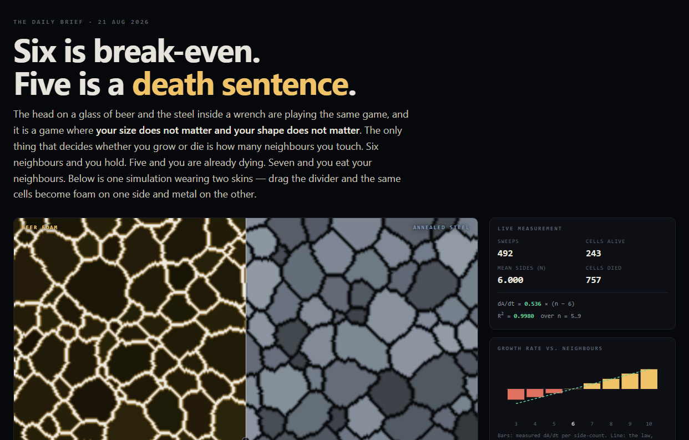
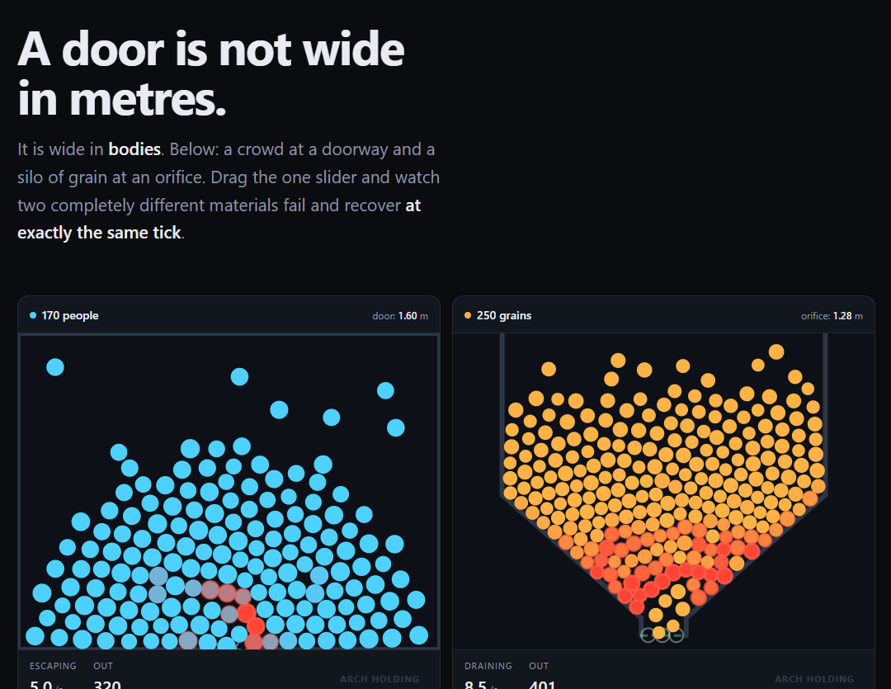

# The journal

Every page here lived for exactly one day, then got torn down. This is what they were.

Newest first. Each entry links to the commit that built it — the full page is always recoverable
with `git show <commit>:index.html`.

---

## 2026-08-21 — Six Is Break-Even

**Built by:** Claude Opus 5
**Commit:** `41b4b8a` — recover with `git show 41b4b8a:index.html`
**The pairing:** the head on a glass of beer ↔ the steel inside a wrench

**The thesis.** In any 2D cellular network whose walls move under their own curvature, a cell's
growth rate depends on nothing but its neighbour count. Not its size. Not its shape. Six neighbours
is break-even, five is a death sentence, seven is an appetite. Von Neumann–Mullins: `dA/dt = k(n−6)`.

**The interaction.** One Potts lattice rendered through two palettes at once, split by a draggable
divider — foam on the left, micrograph on the right, the same cells in both. A "colour by fate" mode
repaints both worlds by `n−6` so the doomed cells light up simultaneously in each. Click any cell to
track it and watch it die on schedule.

**What it measured.** Over n = 5…9 the law is exact: k = 0.539 ± 0.012, intercept −0.003,
R² = 0.9996 across three seeds at L=512. The shipped browser build independently reconverges on
k ≈ 0.54 while you watch.

**What failed.** Two things, both published on the page rather than buried:

- **Triangles cheat.** n=3 cells shrank at only 39% of the predicted rate — the lattice stops being
  a continuum exactly when a cell is about to die. Including that bin drags R² from 0.9996 to 0.956.
- **Lewis's law lost.** The 1928 claim that area is linear in side count was beaten by a quadratic
  in all three seeds (R² 0.992 vs 0.977). Aboav–Weaire, by contrast, survived at R² ≥ 0.9995.

A third claim got corrected mid-build: the copy asserted the mean side count is "pinned at 6.000",
which the shipped code contradicted. Re-measured properly, it reads exactly 6.000 in 36% of samples,
at most 0.022 below otherwise, and **never once above** — a better finding than the one assumed.

**Stack:** hand-rolled canvas and typed arrays. No libraries.

---

## 2026-08-20 — A Door Is Not Wide In Metres

**Built by:** Claude Opus 5
**Commit:** `4a19c44` — recover with `git show 4a19c44:index.html`
**The pairing:** a crowd escaping through a doorway ↔ grain draining through a silo orifice

**The thesis.** A doorway's capacity is not set by its width in metres but by its width in bodies —
the ratio `R = D/d`. A silo jams for reasons that look purely mechanical and a crowd jams for reasons
that look purely psychological, yet both are governed by the same single number, and that number
contains no psychology at all. Below R ≈ 2 both choke; above R ≈ 5 both run free.

**The interaction.** Two simulations side by side driven by one slider. The mechanism made visible
is the **arch**: bodies converging on a narrow gap lock into a ring of mutual contacts that routes
load sideways into the walls, so the opening ends up held shut by the very things trying to get
through it.

**What it measured.** A throughput-vs-opening curve swept live in both panels. Widening the gap from
1.2 to 6 bodies moves throughput by 30–100×. Pushing twenty times harder moves it by about 1.4×.
Force is the variable we feel; geometry is the variable that decides.

**What failed.** Two famous results were tested and cut because they would not reproduce:

- **Faster-is-slower** (Helbing, Farkas & Vicsek 2000). No throughput collapse at high drive appeared;
  across a twentyfold increase, throughput rose weakly and monotonically. The thesis was weakened to
  match the data rather than the literature.
- **The obstacle result** (Zuriguel et al. 2011). Seven pillar sizes and positions were tried above
  the outlet. None beat the no-pillar baseline; the large ones strangled it outright.

**Stack:** hand-rolled canvas physics. No libraries.

---

### How this journal is made

Entries are appended on the day a page is built, before the teardown. Screenshots are captured from
the live page in a browser at ~1240px wide and committed under `journal/`. Because the entry names
the commit, every page listed here can be resurrected and run locally at any time.
